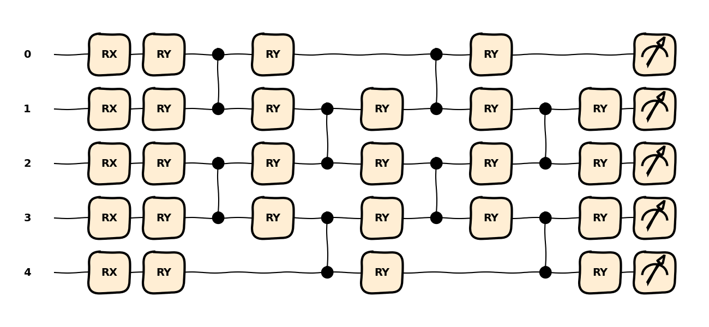
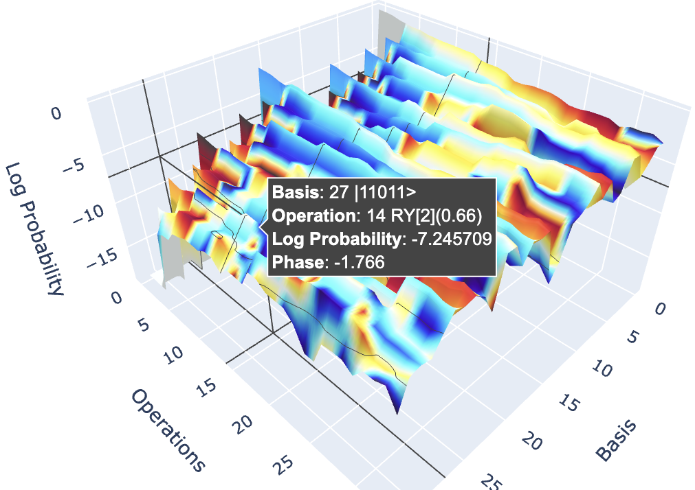
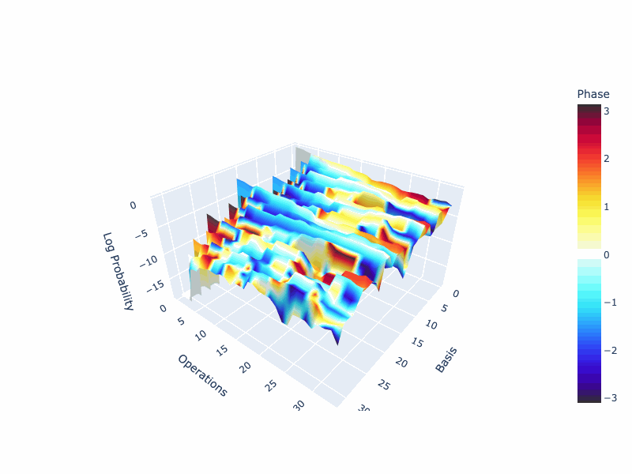
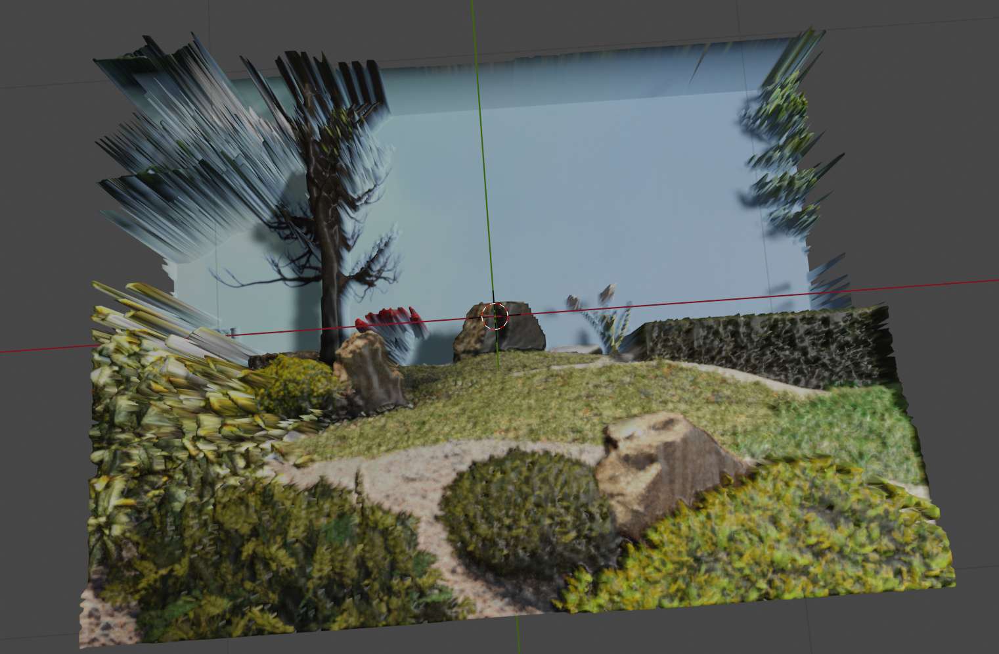

# Quantum & Mixed Reality (qXR)

This project is an attempt to integrate **quantum machine learning (QML)** and **mixed reality (XR)**, for the hackathon event [QHack 2023](https://github.com/XanaduAI/QHack).


<!--

-->

# Prerequisite

We may use the package manager [pip](https://pip.pypa.io/en/stable/) for python=3.10.
We use [Pennylane](https://pennylane.ai/) for QML.

```bash
pip install pennylane
pip install argparse
pip install plotly 
pip install bpy # Blender API (python=3.10 required)
pip install openxr # OpenXR
```

The above packages can be installed by [requirements.txt](requirements.txt)

```bash
pip install -r requirements.txt
```

# Quantum Procedural 3D Modeling

Generative artificial intelligence (AI) technologies such as VAE, GAN, DDPM, and ChatGPT have shown impressive performance lately for artistic work, linguistic work, etc. (e.g., refer [awesome list](https://github.com/yzy1996/Awesome-Generative-Model)). The quantum counterparts --- generative QML framework --- have been also attractive as a [quantum procedural generation](https://arxiv.org/abs/2007.11510). We consider to apply the generative QML for procedural **3D modeling** in XR scenarios.

## QML Visualization

We first provide a new visualization tool chain of QML model for inspection. We use [plotly](https://plotly.com/python/3d-charts/) for interactive 3D visualization of QML model.

### Built-in QML Visualization

Suppose we use a QML model having [AngleEmbedding](https://docs.pennylane.ai/en/stable/code/api/pennylane.AngleEmbedding.html?highlight=qml.AngleEmbedding) to encode features and [SimplifiedTwoDesign](https://docs.pennylane.ai/en/stable/code/api/pennylane.SimplifiedTwoDesign.html) to entangle the states via trainable params like below:

```python
dev = qml.device('default.qubit', 5)
# sample QNN model
@qml.qnode(dev)
def qnode(features, params):
    qml.AngleEmbedding(features, wires=dev.wires)
    qml.SimplifiedTwoDesign(params[0], params[1], wires=dev.wires)
    return [qml.expval(qml.PauliZ(k)) for k in dev.wires]
```

With a built-in [draw()](https://docs.pennylane.ai/en/stable/code/api/pennylane.drawer.draw.html), we can inspect the variational quantum circuit (VQC) in either 'gradient' or 'device' expansion strategy as follows:

```python
print(qml.draw(qnode, expansion_strategy="gradient")(features, params))
0: ─╭AngleEmbedding(M0)─╭SimplifiedTwoDesign─┤  <Z>
1: ─├AngleEmbedding(M0)─├SimplifiedTwoDesign─┤  <Z>
2: ─├AngleEmbedding(M0)─├SimplifiedTwoDesign─┤  <Z>
3: ─├AngleEmbedding(M0)─├SimplifiedTwoDesign─┤  <Z>
4: ─╰AngleEmbedding(M0)─╰SimplifiedTwoDesign─┤  <Z>

print(qml.draw(qnode, expansion_strategy="device")(features, params))
0: ──RX(0.86)──RY(0.82)─╭●──RY(0.09)──────────────╭●──RY(0.56)──────────────┤  <Z>
1: ──RX(0.37)──RY(0.10)─╰Z──RY(0.35)─╭●──RY(0.55)─╰Z──RY(0.77)─╭●──RY(0.90)─┤  <Z>
2: ──RX(0.56)──RY(0.93)─╭●──RY(0.66)─╰Z──RY(0.70)─╭●──RY(0.91)─╰Z──RY(0.46)─┤  <Z>
3: ──RX(0.96)──RY(0.61)─╰Z──RY(0.44)─╭●──RY(0.59)─╰Z──RY(0.09)─╭●──RY(0.45)─┤  <Z>
4: ──RX(0.74)──RY(0.60)──────────────╰Z──RY(0.05)──────────────╰Z──RY(1.00)─┤  <Z>
```

The built-in [draw_mpl()](https://docs.pennylane.ai/en/stable/code/api/pennylane.drawer.draw_mpl.html) provides a nice corresponding plot for the corresponding QML model like:

```python
fig, _ = qml.draw_mpl(qnode, style="sketch", expansion_strategy="device")(features, params)
fig.show()
```



### New QML Visualization

The above drawers need specific `features` and `params` to visualize, but they are not used to show how those variables behave in QML model. We visualize the evolution of quantum states across the QML circuit by measureming quantum [state](https://docs.pennylane.ai/en/stable/code/api/pennylane.state.html?highlight=qml.state) at intermediate circuits decomposed in a quantum [tape](https://docs.pennylane.ai/en/stable/code/api/pennylane.tape.QuantumTape.html).

Our visualization tool is written in [plot_state.py](plot_state.py), consisting two main functions: `state_evolve()` to track the quantum state vector across the QML model; `plot_states()` to visualize in interactive 3D plots. A wrapper function `draw_states()` uses those functions to plot 3D interactive state vector evolutions, using a similar syntax of built-in `draw()`:

```python
from plot_state import draw_states
fig = draw_states(qnode)(features, params)
```


As shown above, we can check probability and phase of each computatinal basis along each quantum operation at the hover text in plotly.
You can experience an example 3D interactive plotly [here](https://toshi-koike-akino.github.io/qxr/).

```python
animate_fig(fig) # create animation gif moving camera
```

Let's enjoy the immersive 3D world!


## Generative QML

We use a new generated QML framework, based on [patched quantum WGAN-GP](https://arxiv.org/pdf/2212.11614.pdf) proposed in 2023 Jan.

### Dataset

 Here, we consider 3D model reconstraction tasks, like [paperswithcode.com](https://paperswithcode.com/datasets?task=depth-estimation). As an example, we pick up [EDEN 3D dataset](https://lhoangan.github.io/eden/). To prepare the dataset, you may use [download_eden.sh](download_eden.sh) and [prep_eden.py](prep_eden.py):

```bash
bash download_eden.sh # to download sample EDEN datasets (19GB)
python prep_eden.py # to prepare data/eden.npz
```

Of course, we can play with different 3D data.

### QML Ansatz

Our QNN model is written in [qnet.py](qnet.py), consisting of two models: `QNN` class as a quantum counterpart of `torch.nn.Linear`; `Quanv2d` class as a quantum `torch.nn.Conv2d`. They have similar syntax of torch such as:

```python
qnn = QNN(in_features, out_features)
quanv = Quanv2d(in_channels, out_channels, kernel_size, stride)
```

We can train them as usual of torch pipelines without carying quantum computing:

```python
opt = torch.optim.AdamW(qnn.parameters(), lr)
for epoch in range(nepoch):
    for x, y in dataloader:
        qnn.zero_grad()
        yhat = qnn(x)
        loss = ...
        loss.backward()
        opt.step()
```  

And, we can easily integrate classical DNN and quantum DNN, like

```python
model = torch.nn.Sequential(
    torch.nn.Conv2d(...),
    Quanv2d(...), # Quantum Conv
    torch.nn.Flatten(),
    torch.nn.Linear(...),
    QNN(...), # Quantum FC
)
```

The required number of qubits is automatically calculated to embed the classical data into VQC.

Our VQC uses either [AmplitudeEmbedding](https://docs.pennylane.ai/en/stable/code/api/pennylane.AmplitudeEmbedding.html) or [AngleEmbedding](https://docs.pennylane.ai/en/stable/code/api/pennylane.AngleEmbedding.html?highlight=qml.AngleEmbedding) depending on `emb` factor. And, measurements are either [probs](https://docs.pennylane.ai/en/stable/code/api/pennylane.probs.html?highlight=qml.probs]) or [expval](https://docs.pennylane.ai/en/stable/code/api/pennylane.expval.html?highlight=qml.expval). AmplitudeEmbedding and probs can deal with exponentially larger dimensions of features, while they may not be fully-supported depending on plugins.

A fully customizable QML framework was introduced in [AutoQML framework](https://arxiv.org/abs/2205.09115), that can  automattically configure best QML ansatz.

### QWGAN Training

Quantum Conditional Wassestern generative adversarial network with gradient penalty (QcWGAN-PG) is implemented in [train.py](train.py), using our [qnet.py](qnet.py). The system is as follows:


We use hybrid classical-quantum DNN model. The useage is as follows:

```bash
python train.py --patch 32 --kernel 5 --gen 3 10 20 10 1 --disc 4 10 20 10 1 --penalty 5.0 
```

For this example, the patch size is 32, CNN kernel size is 5, generator CNN uses [3, 10, 20, 10, 1] channels, discriminator CNN users [5, 10, 20, 10, 1] channels, and gradient penalty is 5.0.
Once the training is done, `gen.pt` and `disc.pt` are saved in `models` folder.
The trained AI model can then be used to reconstruct RGB-D data for rendering.

## QML in Mixed Reality

We use Blender for XR experience of QML. Once the QML generated 3D models, we can render the reconstructed RGB-D data to export into 3D XR data such as FBX.
[blender_surface.py](blender_surface.py) converts images of RGB `rgb.png` and depth `dep.png` into `surface.fbx` through [bpy](https://docs.blender.org/api/current/index.html) library:

```bash
blender --python blender_surface.py
```


It is ready to go with your XR headsets to immerse 3D scenes.

TODO: XR experiments, motion tracking, etc.

# GPU/QPU Devices

## NVIDIA GPU

It is straightforward to use a (or multiple) **graphic processing unit (GPU)** for accelerating QML training/testing. [Pennylane lightening](https://pennylane.ai/blog/2022/07/lightning-fast-simulations-with-pennylane-and-the-nvidia-cuquantum-sdk/) can speed-up quantum simulations through the use of [NVIDIA cuQuantum](https://developer.nvidia.com/cuquantum-sdk). You just need to change the device as follows:

```bash
pip install pennylane-lightning[gpu]
python train.py --dev lightning.gpu
```

For more information, please refer to the [PennyLane Lightning GPU plugin](https://docs.pennylane.ai/projects/lightning-gpu/en/latest/) documentation.

Note: `probs()` measurements are not supported yet for lightning, and you may need to use `--meas expval`.
Below is a benchmark comparison with NVIDIA A100: TBD ...

## IBM QPU

It is straightforward to use a real **quantum processing unit (QPU)** for testing our *qusic*.
For example, we may use [IBM Quantum plugin](https://pennylaneqiskit.readthedocs.io/en/latest/devices/ibmq.html).
You may specify the account token via [Pennylane configulation file](https://pennylane.readthedocs.io/en/latest/introduction/configuration.html), and a scpecific backend of real QPU, such as 'ibmq_london'.
To run our on a real QPU, you just need to change the device as follows:

```bash
pip install pennylane-qiskit # qiskit plugin
python train.py --dev qiskit.ibmq
```

## AWS Braket

We can use different backends such as [Amazon braket plugin](https://amazon-braket-pennylane-plugin-python.readthedocs.io/en/latest/).
For example, we may run as

```bash
pip install amazon-braket-pennylane-plugin # AWS plugin
python train.py --dev braket.aws.qubit
```

Further examples and tutorials are found at [amazon-braket-example](https://github.com/aws/amazon-braket-examples) and [README](https://github.com/aws/amazon-braket-sdk-python/blob/main/README.md).

# License

[MIT](https://choosealicense.com/licenses/mit/).
Copyright (c) 2023 Toshi Koike-Akino. This project is provided 'as-is', without warranty of any kind. In no event shall the authors be liable for any claims, damages, or other such variants.
